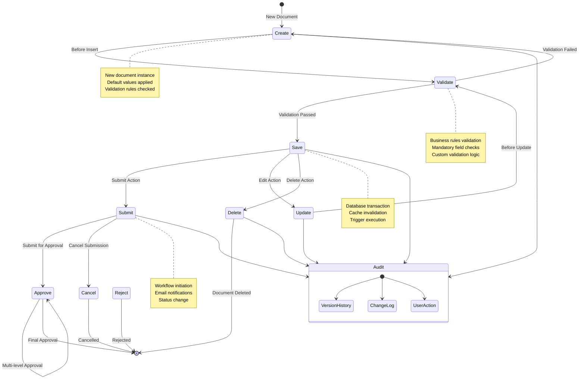

# Document Lifecycle in Frappe

## ASCII Diagram

```
┌─────────────────────────────────────────────────────────────────────────────────┐
│                      Frappe Document Lifecycle                              │
├─────────────────────────────────────────────────────────────────────────────────┤
│                                                                         │
│  ┌─────────────┐    ┌─────────────┐    ┌─────────────┐            │
│  │   Create    │───▶│   Validate   │───▶│   Save      │            │
│  │   (New)     │    │   (Rules)   │    │ (Database)  │            │
│  └──────┬──────┘    └──────┬──────┘    └──────┬──────┘            │
│         │                   │                   │                    │
│         ▼                   ▼                   ▼                    │
│  ┌─────────────┐    ┌─────────────┐    ┌─────────────┐            │
│  │   Submit    │    │   Cancel    │    │   Update    │            │
│  │ (Workflow)  │    │ (Rollback)  │    │ (Changes)   │            │
│  └──────┬──────┘    └──────┬──────┘    └──────┬──────┘            │
│         │                   │                   │                    │
│         ▼                   ▼                   ▼                    │
│  ┌─────────────┐    ┌─────────────┐    ┌─────────────┐            │
│  │   Approve  │    │   Reject    │    │   Delete    │            │
│  │ (Approval)  │    │ (Rejection)  │    │ (Removal)   │            │
│  └──────┬──────┘    └──────┬──────┘    └──────┬──────┘            │
│         │                   │                   │                    │
│         ▼                   ▼                   ▼                    │
│  ┌─────────────────────────────────────────────────────────────┐        │
│  │                 Audit Trail                       │        │
│  │  ┌─────────┐  ┌─────────┐  ┌─────────┐     │        │
│  │  │ Version  │  │  Change  │  │  User    │     │        │
│  │  │ History  │  │  Log     │  │  Action  │     │        │
│  │  └─────────┘  └─────────┘  └─────────┘     │        │
│  └─────────────────────────────────────────────────────────────┘        │
│                                                                         │
└─────────────────────────────────────────────────────────────────────────────────┘
```

## Mermaid Diagram



## Lifecycle Stages Explained

### 1. Create Stage
- **Trigger**: User creates new document
- **Actions**: 
  - Initialize document with default values
  - Apply naming series
  - Set initial status
- **Hooks**: `before_insert`, `after_insert`

### 2. Validate Stage
- **Trigger**: Before saving to database
- **Actions**:
  - Validate mandatory fields
  - Apply business rules
  - Check permissions
- **Hooks**: `validate`

### 3. Save Stage
- **Trigger**: Document passes validation
- **Actions**:
  - Execute database INSERT/UPDATE
  - Update cache
  - Run triggers
- **Hooks**: `before_save`, `after_save`

### 4. Submit Stage
- **Trigger**: User submits document
- **Actions**:
  - Change document status
  - Initiate workflow
  - Send notifications
- **Hooks**: `on_submit`, `on_update_after_submit`

### 5. Approve/Reject Stage
- **Trigger**: Workflow approval/rejection
- **Actions**:
  - Update workflow status
  - Execute approval logic
  - Send notifications
- **Hooks**: Custom workflow methods

### 6. Update Stage
- **Trigger**: User edits existing document
- **Actions**:
  - Validate changes
  - Update database
  - Maintain version history
- **Hooks**: `before_update`, `after_update`

### 7. Delete Stage
- **Trigger**: User deletes document
- **Actions**:
  - Check delete permissions
  - Soft delete or hard delete
  - Clean up related data
- **Hooks**: `before_delete`, `after_delete`, `on_trash`

### 8. Audit Trail
- **Continuous**: Throughout lifecycle
- **Actions**:
  - Record all changes
  - Track user actions
  - Maintain version history
- **Storage**: `Version` DocType, `Activity Log`

## Hook Execution Order

```python
# Document hook execution order
class DocumentHooks:
    """
    Hook execution order for document operations:
    
    CREATE:
    1. before_insert
    2. validate
    3. before_save
    4. Database INSERT
    5. after_save
    6. after_insert
    
    UPDATE:
    1. before_update
    2. validate
    3. before_save
    4. Database UPDATE
    5. after_save
    6. after_update
    
    SUBMIT:
    1. on_submit
    2. on_update_after_submit
    
    DELETE:
    1. before_delete
    2. on_trash
    3. Database DELETE
    4. after_delete
    """
    pass
```

## Best Practices

### 1. Hook Implementation
- Keep hook methods lightweight
- Use transactions for data consistency
- Handle exceptions gracefully
- Log important actions

### 2. Validation Logic
- Validate at both client and server
- Provide clear error messages
- Use Frappe's validation framework
- Implement custom validation rules

### 3. Workflow Design
- Define clear approval paths
- Implement proper notifications
- Handle rejection scenarios
- Consider multi-level approvals

### 4. Performance Optimization
- Minimize database queries in hooks
- Use caching for expensive operations
- Batch operations when possible
- Optimize trigger logic

## Common Patterns

### Pattern 1: Auto-Naming
```python
def autoname(self):
    """Generate document name automatically"""
    if self.customer:
        self.name = f"ORD-{self.customer}-{frappe.utils.nowdate()}"
```

### Pattern 2: Validation
```python
def validate(self):
    """Validate document data"""
    if not self.email:
        frappe.throw("Email is required")
    
    if self.amount <= 0:
        frappe.throw("Amount must be positive")
```

### Pattern 3: Auto-Population
```python
def before_save(self):
    """Auto-populate fields before saving"""
    if not self.total_amount:
        self.total_amount = self.quantity * self.rate
```

### Pattern 4: Workflow Integration
```python
def on_submit(self):
    """Handle document submission"""
    # Send notifications
    frappe.sendmail(
        recipients=self.approver,
        subject=f"Document {self.name} submitted for approval",
        message=f"Please review and approve {self.name}"
    )
    
    # Update related documents
    self.update_related_records()
```

## Debugging Tips

1. **Use Frappe Logs**: Check `frappe.log_error()` outputs
2. **Enable Debug Mode**: Set `debug = 1` in site_config
3. **Hook Tracing**: Add logging to hook methods
4. **Database Queries**: Use `frappe.db.sql` with `debug=True`
5. **Performance Analysis**: Use `frappe.utils.timeit` for timing

## Security Considerations

1. **Permission Checks**: Always validate user permissions
2. **Data Validation**: Never trust user input
3. **SQL Injection**: Use Frappe's ORM, not raw SQL
4. **Audit Logging**: Log all sensitive operations
5. **Access Control**: Implement proper role-based access
