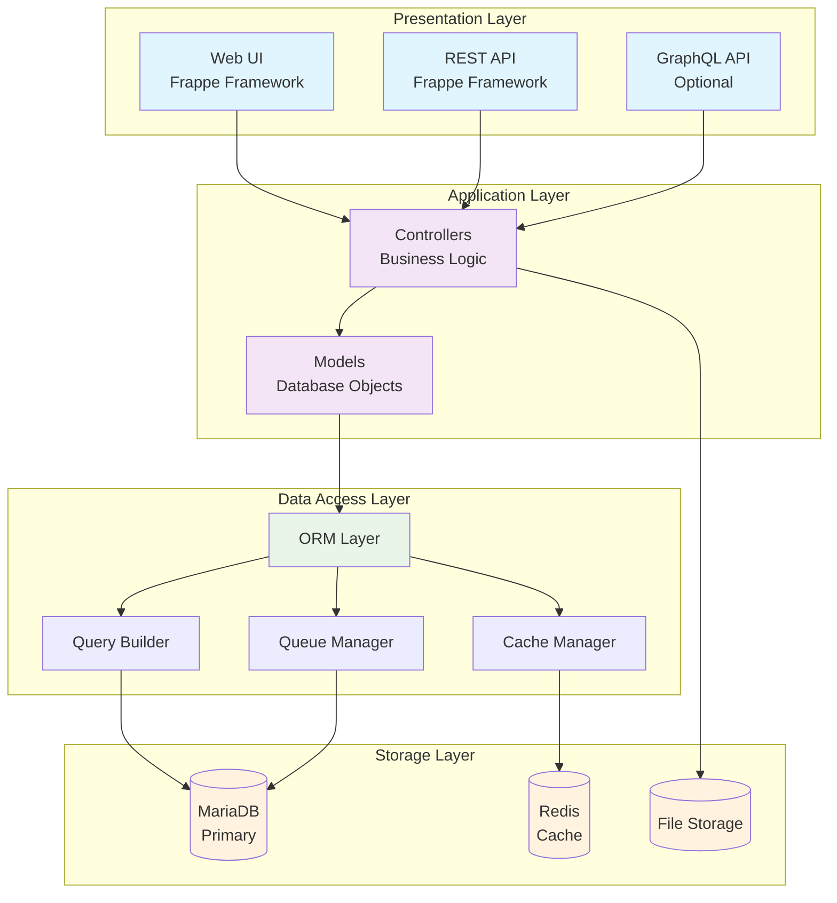

# ERPNext System Architecture

## ASCII Diagram

```
┌─────────────────────────────────────────────────────────────────────────────────┐
│                           ERPNext System Architecture                        │
├─────────────────────────────────────────────────────────────────────────────────┤
│                                                                         │
│  ┌─────────────┐    ┌─────────────┐    ┌─────────────┐            │
│  │   Web UI    │    │   REST API  │    │   GraphQL   │            │
│  │   (Frappe    │    │   (Frappe    │    │   API       │            │
│  │   Framework)  │    │   Framework)  │    │   (Optional) │            │
│  └──────┬──────┘    └──────┬──────┘    └──────┬──────┘            │
│         │                   │                   │                    │
│         └───────────────────┴───────────────────┘                    │
│                                │                                        │
│         ┌─────────────────────────────────────────────┐                │
│         │           Application Layer               │                │
│         │  ┌─────────────┐  ┌─────────────┐     │                │
│         │  │  Controllers │  │   Models     │     │                │
│         │  │ (Business   │  │ (Database    │     │                │
│         │  │   Logic)    │  │  Objects)    │     │                │
│         │  └──────┬──────┘  └──────┬──────┘     │                │
│         │         │                 │             │                │
│         └─────────┴─────────────────┴─────────────┘                │
│                                │                                        │
│  ┌─────────────────────────────────────────────────────────────┐        │
│  │                  ORM Layer                             │        │
│  │  ┌─────────────┐  ┌─────────────┐  ┌─────────────┐│        │
│  │  │   Query     │  │   Cache     │  │   Queue     ││        │
│  │  │  Builder    │  │  Manager    │  │  Manager    ││        │
│  │  └──────┬──────┘  └──────┬──────┘  └──────┬──────┘│        │
│  │         │                 │                 │        │        │
│  └─────────┴─────────────────┴─────────────────┴────────┘        │
│                                │                                        │
│  ┌─────────────────────────────────────────────────────────────┐        │
│  │                   Database Layer                       │        │
│  │  ┌─────────────┐  ┌─────────────┐  ┌─────────────┐│        │
│  │  │   MariaDB   │  │    Redis    │  │  File       ││        │
│  │  │ (Primary)   │  │   (Cache)   │  │ Storage     ││        │
│  │  └─────────────┘  └─────────────┘  └─────────────┘│        │
│  └─────────────────────────────────────────────────────────────┘        │
│                                                                         │
└─────────────────────────────────────────────────────────────────────────────────┘
```

## Mermaid Diagram



## Component Explanation

### Presentation Layer
- **Web UI**: Frappe Framework's built-in web interface
- **REST API**: Standard RESTful API for external integrations
- **GraphQL API**: Optional GraphQL endpoint for complex queries

### Application Layer
- **Controllers**: Business logic and request handling
- **Models**: Database object definitions and relationships

### Data Access Layer
- **ORM Layer**: Object-relational mapping for database operations
- **Query Builder**: Dynamic query construction and optimization
- **Cache Manager**: Multi-level caching for performance
- **Queue Manager**: Background job processing

### Storage Layer
- **MariaDB**: Primary database for persistent data
- **Redis**: In-memory cache for fast access
- **File Storage**: File system for documents and media

## Key Architecture Principles

1. **Layered Architecture**: Clear separation of concerns
2. **Modular Design**: Independent, replaceable components
3. **Scalability**: Horizontal scaling at each layer
4. **Performance**: Caching and optimization throughout
5. **Security**: Authentication and authorization at each layer

## Implementation Notes

- Each layer communicates through well-defined interfaces
- Caching is implemented at multiple levels for optimal performance
- Background jobs are processed asynchronously through the queue system
- File storage can be local or cloud-based
- Database can be scaled with read replicas

## Scaling Considerations

- **Web Layer**: Load balancer with multiple web servers
- **Application Layer**: Stateless design for horizontal scaling
- **Database Layer**: Master-slave replication for read scaling
- **Cache Layer**: Redis clustering for distributed caching
- **File Storage**: CDN integration for static assets
