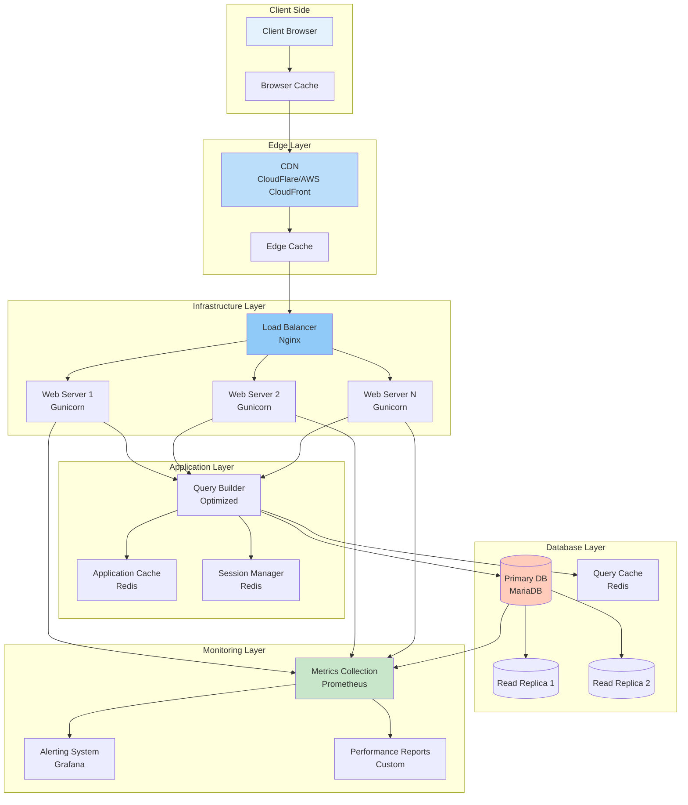

# Performance Optimization Architecture

## ASCII Diagram

```
┌─────────────────────────────────────────────────────────────────────────────────┐
│                    ERPNext Performance Optimization                      │
├─────────────────────────────────────────────────────────────────────────────────┤
│                                                                         │
│  ┌─────────────┐    ┌─────────────┐    ┌─────────────┐            │
│  │   Client    │    │   CDN      │    │   Load      │            │
│  │   Browser   │◀───│   Edge      │◀───│   Balancer  │            │
│  │  Caching    │    │  Caching    │    │ (Nginx)     │            │
│  └──────┬──────┘    └──────┬──────┘    └──────┬──────┘            │
│         │                   │                   │                    │
│         └───────────────────┴───────────────────┘                    │
│                                │                                        │
│  ┌─────────────────────────────────────────────────────────────┐        │
│  │                Web Server Layer                   │        │
│  │  ┌─────────────┐  ┌─────────────┐  ┌─────────────┐│        │
│  │  │   Gunicorn  │  │   Worker    │  │   Process   ││        │
│  │  │  (Multi)    │  │   Pool      │  │   Manager   ││        │
│  │  └──────┬──────┘  └──────┬──────┘  └──────┬──────┘│        │
│  │         │                 │                 │        │        │
│  └─────────┴─────────────────┴─────────────────┴────────┘        │
│                                │                                        │
│  ┌─────────────────────────────────────────────────────────────┐        │
│  │              Application Layer                     │        │
│  │  ┌─────────────┐  ┌─────────────┐  ┌─────────────┐│        │
│  │  │   Query     │  │   Cache     │  │   Session   ││        │
│  │  │  Builder    │  │  Manager    │  │  Manager   ││        │
│  │  └──────┬──────┘  └──────┬──────┘  └──────┬──────┘│        │
│  │         │                 │                 │        │        │
│  └─────────┴─────────────────┴─────────────────┴────────┘        │
│                                │                                        │
│  ┌─────────────────────────────────────────────────────────────┐        │
│  │                Database Layer                      │        │
│  │  ┌─────────────┐  ┌─────────────┐  ┌─────────────┐│        │
│  │  │   Primary   │  │   Read      │  │   Query    ││        │
│  │  │   Database  │  │   Replicas  │  │   Cache    ││        │
│  │  └──────┬──────┘  └──────┬──────┘  └──────┬──────┘│        │
│  │         │                 │                 │        │        │
│  └─────────┴─────────────────┴─────────────────┴────────┘        │
│                                                                         │
│  ┌─────────────────────────────────────────────────────────────┐        │
│  │              Monitoring & Analytics               │        │
│  │  ┌─────────────┐  ┌─────────────┐  ┌─────────────┐│        │
│  │  │   Metrics   │  │   Alerts    │  │   Reports   ││        │
│  │  │ Collection  │  │  System     │  │ Generation  ││        │
│  │  └─────────────┘  └─────────────┘  └─────────────┘│        │
│  └─────────────────────────────────────────────────────────────┘        │
│                                                                         │
└─────────────────────────────────────────────────────────────────────────────────┘
```

## Mermaid Diagram



## Optimization Layers Explained

### 1. Client-Side Optimization
- **Browser Caching**: Static assets cached locally
- **Resource Minification**: CSS/JS compression
- **Image Optimization**: WebP format, lazy loading
- **HTTP/2**: Multiplexed requests

### 2. Edge Caching
- **CDN Integration**: Global content delivery
- **Edge Cache**: Frequently accessed content
- **DDoS Protection**: Traffic filtering
- **SSL Termination**: Secure connection handling

### 3. Load Balancing
- **Round Robin**: Even distribution
- **Health Checks**: Failover handling
- **SSL Offloading**: Reduce server load
- **Rate Limiting**: Prevent abuse

### 4. Application Optimization
- **Query Optimization**: Efficient database queries
- **Connection Pooling**: Reuse database connections
- **Caching Strategy**: Multi-level caching
- **Background Jobs**: Asynchronous processing

### 5. Database Optimization
- **Indexing Strategy**: Proper index usage
- **Read Replicas**: Distribute read load
- **Query Cache**: Cache frequent queries
- **Connection Management**: Optimize connections

### 6. Monitoring & Analytics
- **Real-time Metrics**: Performance tracking
- **Alert System**: Proactive monitoring
- **Performance Reports**: Regular analysis
- **Bottleneck Detection**: Identify issues

## Performance Metrics

### Key Performance Indicators (KPIs)

```python
class PerformanceMetrics:
    """Key performance metrics for ERPNext"""
    
    # Response Time Metrics
    avg_response_time = "< 500ms"
    p95_response_time = "< 1s"
    p99_response_time = "< 2s"
    
    # Throughput Metrics
    requests_per_second = "> 1000"
    concurrent_users = "> 500"
    database_queries_per_second = "< 500"
    
    # Resource Utilization
    cpu_utilization = "< 70%"
    memory_utilization = "< 80%"
    disk_io_utilization = "< 80%"
    
    # Cache Performance
    cache_hit_ratio = "> 90%"
    cache_miss_rate = "< 10%"
    
    # Database Performance
    slow_query_rate = "< 5%"
    connection_pool_utilization = "< 80%"
    replication_lag = "< 1s"
    
    # Error Metrics
    error_rate = "< 1%"
    timeout_rate = "< 0.1%"
    availability = "> 99.9%"
```

## Optimization Techniques

### 1. Database Optimization

```python
# Query optimization examples
class QueryOptimization:
    """Database query optimization techniques"""
    
    def optimized_customer_query(self):
        """Optimized customer query with proper indexing"""
        return frappe.db.sql("""
            SELECT 
                c.name, c.customer_name, c.email_id,
                COUNT(so.name) as order_count,
                SUM(so.grand_total) as total_value
            FROM 
                `tabCustomer` c
            LEFT JOIN 
                `tabSales Order` so ON c.name = so.customer
            WHERE 
                c.status = 'Active'
                AND so.status != 'Cancelled'
            GROUP BY 
                c.name, c.customer_name, c.email_id
            ORDER BY 
                total_value DESC
            LIMIT 100
        """, as_dict=True)
    
    def batch_update_optimization(self, records):
        """Batch update for better performance"""
        # Instead of individual updates
        # for record in records:
        #     frappe.db.set_value("Customer", record.name, "status", record.status)
        
        # Use batch update
        frappe.db.sql("""
            UPDATE `tabCustomer` 
            SET status = CASE name
                {case_statements}
            END
            WHERE name IN ({placeholders})
        """.format(
            case_statements=" ".join([
                f"WHEN '{r.name}' THEN '{r.status}'" 
                for r in records
            ]),
            placeholders=", ".join(["%s"] * len(records))
        ), [r.name for r in records])
```

### 2. Caching Strategy

```python
# Multi-level caching implementation
class MultiLevelCache:
    """Multi-level caching strategy"""
    
    def __init__(self):
        self.l1_cache = {}  # Memory cache
        self.l2_cache = frappe.cache()  # Redis cache
        self.l3_cache = None  # Database cache
    
    def get(self, key):
        """Get from cache with fallback"""
        # Level 1: Memory cache
        if key in self.l1_cache:
            return self.l1_cache[key]
        
        # Level 2: Redis cache
        value = self.l2_cache.get(key)
        if value:
            self.l1_cache[key] = value  # Promote to L1
            return value
        
        # Level 3: Database
        value = self.get_from_database(key)
        if value:
            self.l2_cache.set(key, value, timeout=3600)  # 1 hour
            self.l1_cache[key] = value
        
        return value
    
    def invalidate(self, key):
        """Invalidate across all levels"""
        self.l1_cache.pop(key, None)
        self.l2_cache.delete(key)
        # Database cache invalidated via triggers
```

### 3. Background Job Optimization

```python
# Optimized background job processing
class OptimizedBackgroundJobs:
    """Optimized background job processing"""
    
    def process_in_batches(self, job_name, batch_size=100):
        """Process jobs in batches for better performance"""
        
        while True:
            # Get batch of jobs
            jobs = frappe.db.sql("""
                SELECT name, job_data, creation
                FROM `tabBackground Job`
                WHERE job_name = %s
                AND status = 'Queued'
                ORDER BY creation ASC
                LIMIT %s
                FOR UPDATE
            """, (job_name, batch_size), as_dict=True)
            
            if not jobs:
                break
            
            # Process batch
            for job in jobs:
                try:
                    self.process_single_job(job)
                    frappe.db.set_value(
                        "Background Job", job.name, 
                        "status", "Completed"
                    )
                except Exception as e:
                    frappe.db.set_value(
                        "Background Job", job.name, 
                        "status", "Failed"
                    )
                    frappe.log_error(str(e), f"Background Job {job.name}")
            
            frappe.db.commit()
```

## Monitoring Setup

### 1. Prometheus Metrics

```python
# Prometheus metrics collection
class PrometheusMetrics:
    """Prometheus metrics for ERPNext"""
    
    def __init__(self):
        self.request_count = Counter('erpnext_requests_total')
        self.request_duration = Histogram('erpnext_request_duration_seconds')
        self.active_connections = Gauge('erpnext_active_connections')
        self.cache_hits = Counter('erpnext_cache_hits_total')
        self.cache_misses = Counter('erpnext_cache_misses_total')
    
    def record_request(self, duration):
        """Record request metrics"""
        self.request_count.inc()
        self.request_duration.observe(duration)
    
    def record_cache_hit(self):
        """Record cache hit"""
        self.cache_hits.inc()
    
    def record_cache_miss(self):
        """Record cache miss"""
        self.cache_misses.inc()
```

### 2. Grafana Dashboard

```json
{
  "dashboard": {
    "title": "ERPNext Performance Dashboard",
    "panels": [
      {
        "title": "Request Rate",
        "type": "graph",
        "targets": [
          {
            "expr": "rate(erpnext_requests_total[5m])",
            "legendFormat": "Requests/sec"
          }
        ]
      },
      {
        "title": "Response Time",
        "type": "graph",
        "targets": [
          {
            "expr": "histogram_quantile(0.95, rate(erpnext_request_duration_seconds_bucket[5m]))",
            "legendFormat": "95th percentile"
          }
        ]
      },
      {
        "title": "Cache Hit Ratio",
        "type": "singlestat",
        "targets": [
          {
            "expr": "erpnext_cache_hits_total / (erpnext_cache_hits_total + erpnext_cache_misses_total)",
            "legendFormat": "Hit Ratio"
          }
        ]
      }
    ]
  }
}
```

## Performance Testing

### Load Testing Script

```python
# Load testing with Locust
from locust import HttpUser, task, between

class ERPNextUser(HttpUser):
    wait_time = between(1, 3)
    
    def on_start(self):
        """Login on start"""
        response = self.client.post("/api/method/login", {
            "usr": "test@example.com",
            "pwd": "password"
        })
        self.token = response.json()["message"]
    
    @task(3)
    def view_dashboard(self):
        """View dashboard"""
        self.client.get("/app/dashboard", headers={
            "X-Frappe-CSRF-Token": self.token
        })
    
    @task(2)
    def list_customers(self):
        """List customers"""
        self.client.get("/app/customer", headers={
            "X-Frappe-CSRF-Token": self.token
        })
    
    @task(1)
    def create_sales_order(self):
        """Create sales order"""
        self.client.post("/api/method/frappe.client.insert", json={
            "doc": {
                "doctype": "Sales Order",
                "customer": "Test Customer",
                "items": [{"item_code": "Test Item", "qty": 1}]
            }
        }, headers={
            "X-Frappe-CSRF-Token": self.token
        })
```

## Best Practices

### 1. Database Optimization
- Use proper indexes for frequent queries
- Avoid N+1 query problems
- Implement read replicas for reporting
- Monitor slow queries regularly

### 2. Caching Strategy
- Implement multi-level caching
- Use appropriate cache expiration
- Cache frequently accessed data
- Invalidate cache properly on updates

### 3. Application Performance
- Minimize database round trips
- Use connection pooling
- Implement background processing
- Optimize frontend assets

### 4. Infrastructure Scaling
- Use load balancers for distribution
- Implement auto-scaling policies
- Monitor resource utilization
- Plan capacity requirements

### 5. Monitoring & Alerting
- Set up comprehensive monitoring
- Define clear alert thresholds
- Implement proactive alerting
- Regular performance reviews
