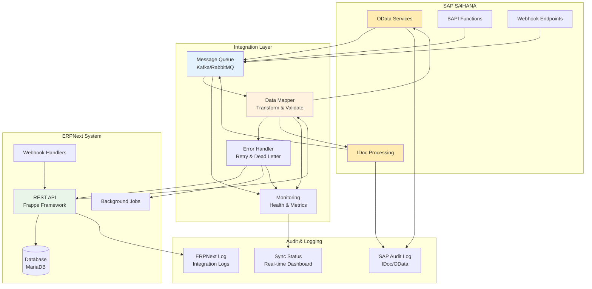

# SAP Integration Architecture

## ASCII Diagram

```
┌─────────────────────────────────────────────────────────────────────────────────┐
│                        SAP-ERPNext Integration                           │
├─────────────────────────────────────────────────────────────────────────────────┤
│                                                                         │
│  ┌─────────────┐    ┌─────────────┐    ┌─────────────┐            │
│  │    SAP      │    │   Message   │    │  ERPNext    │            │
│  │   S/4HANA   │◀───│   Queue     │◀───│  System     │            │
│  │             │    │  (Kafka/    │    │             │            │
│  │  OData/IDoc │    │   RabbitMQ)  │    │  REST API   │            │
│  └──────┬──────┘    └──────┬──────┘    └──────┬──────┘            │
│         │                   │                   │                    │
│         ▼                   ▼                   ▼                    │
│  ┌─────────────┐    ┌─────────────┐    ┌─────────────┐            │
│  │  Data       │    │  Error      │    │  Monitor    │            │
│  │  Mapper     │    │  Handler    │    │  ing       │            │
│  │ (Transform)  │    │ (Retry/     │    │ (Health/    │            │
│  │             │    │  Dead       │    │  Metrics)   │            │
│  └──────┬──────┘    └──────┬──────┘    └──────┬──────┘            │
│         │                   │                   │                    │
│         ▼                   ▼                   ▼                    │
│  ┌─────────────────────────────────────────────────────────────┐        │
│  │                 Audit Trail                       │        │
│  │  ┌─────────┐  ┌─────────┐  ┌─────────┐     │        │
│  │  │ SAP Log  │  │ERPNext  │  │ Sync     │     │        │
│  │  │(IDoc/   │  │  Log    │  │ Status  │     │        │
│  │  │ OData)   │  │         │  │ Report  │     │        │
│  │  └─────────┘  └─────────┘  └─────────┘     │        │
│  └─────────────────────────────────────────────────────────────┘        │
│                                                                         │
└─────────────────────────────────────────────────────────────────────────────────┘

┌─────────────────────────────────────────────────────────────────────────────────┐
│                    Integration Data Flows                               │
├─────────────────────────────────────────────────────────────────────────────────┤
│                                                                         │
│  SAP → ERPNext:                        ERPNext → SAP:               │
│  ┌─────────────┐                      ┌─────────────┐              │
│  │ Customer   │                      │ Sales       │              │
│  │ Master     │                      │ Order       │              │
│  │ (IDoc)     │                      │ (OData)     │              │
│  └──────┬──────┘                      └──────┬──────┘              │
│         │                                   │                        │
│  ┌─────────────┐                      ┌─────────────┐              │
│  │ Material   │                      │ Invoice     │              │
│  │ Master     │                      │ (IDoc)     │              │
│  │ (OData)     │                      │             │              │
│  └─────────────┘                      └─────────────┘              │
│                                                                         │
│  Real-time Sync:                      Batch Sync:                    │
│  ┌─────────────┐                      ┌─────────────┐              │
│  │ Inventory  │                      │ Historical  │              │
│  │ Levels     │                      │ Data        │              │
│  │ (Webhook)   │                      │ (Scheduled)  │              │
│  └─────────────┘                      └─────────────┘              │
│                                                                         │
└─────────────────────────────────────────────────────────────────────────────────┘
```

## Mermaid Diagram



## Integration Components Explained

### 1. SAP Components
- **OData Services**: RESTful API for modern integration
- **IDoc Processing**: Traditional SAP document exchange
- **BAPI Functions**: Direct SAP business logic calls
- **Webhook Endpoints**: Real-time event notifications

### 2. Integration Layer
- **Message Queue**: Asynchronous processing buffer
- **Data Mapper**: Field mapping and transformation
- **Error Handler**: Retry logic and dead letter queue
- **Monitoring**: Health checks and performance metrics

### 3. ERPNext Components
- **REST API**: Standard Frappe API endpoints
- **Database**: MariaDB for data persistence
- **Webhook Handlers**: Custom webhook processing
- **Background Jobs**: Asynchronous task processing

### 4. Audit & Logging
- **SAP Audit Log**: Track SAP-side activities
- **ERPNext Log**: Track ERPNext-side activities
- **Sync Status**: Real-time synchronization dashboard

## Integration Patterns

### 1. Real-time Synchronization

```python
# Real-time sync implementation
class RealTimeSynchronization:
    """Real-time SAP-ERPNext synchronization"""
    
    def __init__(self):
        self.message_queue = MessageQueue()
        self.data_mapper = SAPDataMapper()
        self.error_handler = ErrorHandler()
    
    def process_sap_idoc(self, idoc_data):
        """Process incoming SAP IDoc"""
        try:
            # Transform IDoc to ERPNext format
            erpnext_data = self.data_mapper.transform_idoc(idoc_data)
            
            # Validate data
            self.validate_erpnext_data(erpnext_data)
            
            # Create/update ERPNext document
            doc = frappe.get_doc(erpnext_data)
            doc.insert(ignore_permissions=True)
            
            # Log successful sync
            self.log_sync_success(idoc_data, doc.name)
            
        except Exception as e:
            # Handle error and retry
            self.error_handler.handle_error(e, idoc_data)
    
    def send_to_sap(self, erpnext_doc):
        """Send ERPNext document to SAP"""
        try:
            # Transform to SAP format
            sap_data = self.data_mapper.transform_to_sap(erpnext_doc)
            
            # Send via OData
            response = self.call_sap_odata(sap_data)
            
            # Update ERPNext with SAP reference
            erpnext_doc.db_set('sap_reference', response['id'])
            erpnext_doc.db_set('sync_status', 'Synced')
            
        except Exception as e:
            # Queue for retry
            self.error_handler.queue_for_retry(erpnext_doc, e)
```

### 2. Batch Processing

```python
# Batch processing for large data volumes
class BatchProcessing:
    """Batch processing for SAP-ERPNext integration"""
    
    def __init__(self):
        self.batch_size = 100
        self.processing_queue = Queue()
    
    def process_customer_master(self):
        """Process customer master data in batches"""
        offset = 0
        
        while True:
            # Get batch from SAP
            sap_customers = self.get_sap_customers(
                limit=self.batch_size, 
                offset=offset
            )
            
            if not sap_customers:
                break
            
            # Process batch
            for sap_customer in sap_customers:
                try:
                    # Transform and create/update
                    erpnext_customer = self.data_mapper.transform_customer(
                        sap_customer
                    )
                    self.create_or_update_customer(erpnext_customer)
                    
                except Exception as e:
                    self.log_batch_error(sap_customer, e)
            
            # Commit batch
            frappe.db.commit()
            offset += self.batch_size
    
    def get_sap_customers(self, limit, offset):
        """Get customers from SAP via OData"""
        url = f"{self.sap_base_url}/sap/opu/odata/sap/ZCUSTOMER_SRV"
        params = {
            '$top': limit,
            '$skip': offset,
            '$format': 'json'
        }
        
        response = requests.get(url, params=params, auth=self.sap_auth)
        response.raise_for_status()
        
        return response.json().get('d', {}).get('results', [])
```

### 3. Error Handling and Retry Logic

```python
# Comprehensive error handling
class IntegrationErrorHandler:
    """Error handling for SAP-ERPNext integration"""
    
    def __init__(self):
        self.retry_config = {
            'max_retries': 3,
            'backoff_factor': 2,
            'initial_delay': 1  # seconds
        }
        self.dead_letter_queue = DeadLetterQueue()
    
    def handle_error(self, error, data, context=None):
        """Handle integration errors with retry logic"""
        
        error_type = self.classify_error(error)
        
        if error_type in ['network_timeout', 'temporary_failure']:
            # Retryable error
            self.retry_with_backoff(data, error, context)
        elif error_type in ['data_validation', 'business_rule']:
            # Non-retryable error
            self.log_permanent_error(data, error, context)
        else:
            # Unknown error - investigate
            self.send_alert(data, error, context)
    
    def retry_with_backoff(self, data, original_error, context):
        """Retry with exponential backoff"""
        
        retry_count = context.get('retry_count', 0)
        
        if retry_count >= self.retry_config['max_retries']:
            # Max retries reached - move to dead letter queue
            self.dead_letter_queue.add(data, original_error)
            return
        
        # Calculate delay
        delay = (
            self.retry_config['initial_delay'] * 
            (self.retry_config['backoff_factor'] ** retry_count)
        )
        
        # Schedule retry
        frappe.enqueue_job(
            'retry_integration',
            data=data,
            context={**context, 'retry_count': retry_count + 1},
            queue='integration',
            execute_after=frappe.utils.add_seconds(
                frappe.utils.now(), delay
            )
        )
```

## Data Mapping Examples

### Customer Data Mapping

```python
# Customer field mapping between SAP and ERPNext
class CustomerDataMapping:
    """Customer data mapping between SAP and ERPNext"""
    
    sap_to_erpnext = {
        # SAP field -> ERPNext field
        'PARTNER': 'name',                    # Business Partner
        'NAME_ORG1': 'customer_name',          # Organization Name
        'STREET': 'address_line_1',             # Street
        'CITY': 'city',                        # City
        'POST_CODE1': 'pincode',                 # Postal Code
        'COUNTRY': 'country',                    # Country
        'TEL_NUMBER': 'phone_no',                # Phone Number
        'SMTP_ADDR': 'email_id',                 # Email Address
        'BP_GROUP': 'customer_group',             # Customer Group
        'AUTH_GRP': 'territory',                  # Authorization Group
    }
    
    def transform_sap_to_erpnext(self, sap_customer):
        """Transform SAP customer to ERPNext format"""
        
        erpnext_customer = {}
        
        # Map standard fields
        for sap_field, erpnext_field in self.sap_to_erpnext.items():
            if sap_field in sap_customer:
                erpnext_customer[erpnext_field] = sap_customer[sap_field]
        
        # Apply business logic transformations
        erpnext_customer.update({
            'customer_type': self.determine_customer_type(sap_customer),
            'default_currency': self.get_default_currency(),
            'credit_limit': self.convert_credit_limit(sap_customer.get('CREDIT_LIM')),
            'payment_terms': self.map_payment_terms(sap_customer.get('ZTERM')),
            'sales_team': self.map_sales_team(sap_customer.get('VKORG')),
        })
        
        return erpnext_customer
    
    def determine_customer_type(self, sap_customer):
        """Determine customer type based on SAP data"""
        
        bp_group = sap_customer.get('BP_GROUP', '')
        
        if bp_group in ['Z001', 'Z002']:
            return 'Company'
        elif bp_group in ['Z003', 'Z004']:
            return 'Individual'
        else:
            return 'Company'  # Default
    
    def convert_credit_limit(self, sap_credit_limit):
        """Convert SAP credit limit to ERPNext format"""
        
        if not sap_credit_limit:
            return 0
        
        # SAP stores credit limit in internal currency
        # Convert to ERPNext currency
        return float(sap_credit_limit) * self.get_exchange_rate()
```

### Sales Order Mapping

```python
# Sales order mapping
class SalesOrderMapping:
    """Sales order mapping between SAP and ERPNext"""
    
    def transform_erpnext_to_sap(self, erpnext_so):
        """Transform ERPNext sales order to SAP format"""
        
        sap_order = {
            'DocumentType': 'OR',  # Standard Order
            'SalesOrganization': erpnext_so.company or '1000',
            'DistributionChannel': '10',
            'Division': '00',
            'SoldToParty': erpnext_so.customer,
            'RequestDate': erpnext_so.transaction_date.strftime('%Y%m%d'),
            'PricingDate': erpnext_so.transaction_date.strftime('%Y%m%d'),
            'Currency': erpnext_so.currency,
        }
        
        # Map items
        sap_items = []
        for item in erpnext_so.items:
            sap_item = {
                'Material': item.item_code,
                'RequestedQuantity': str(item.qty),
                'SalesUnit': item.uom or 'EA',
                'ItemCategory': self.get_item_category(item.item_code),
                'NetPrice': str(item.rate),
                'Currency': erpnext_so.currency,
            }
            sap_items.append(sap_item)
        
        sap_order['Item'] = sap_items
        
        # Add partner functions
        sap_order['PartnerFunctions'] = [
            {
                'PartnRole': 'AG',  # Sold-to party
                'PartnNumb': erpnext_so.customer
            },
            {
                'PartnRole': 'WE',  # Ship-to party
                'PartnNumb': erpnext_so.shipping_address_name
            }
        ]
        
        return sap_order
```

## Monitoring and Alerting

### Integration Health Dashboard

```python
# Integration monitoring
class IntegrationMonitor:
    """Monitor SAP-ERPNext integration health"""
    
    def __init__(self):
        self.metrics_collector = MetricsCollector()
        self.alert_manager = AlertManager()
    
    def collect_metrics(self):
        """Collect integration metrics"""
        
        metrics = {
            'message_queue_depth': self.get_queue_depth(),
            'processing_rate': self.get_processing_rate(),
            'error_rate': self.get_error_rate(),
            'sync_lag': self.get_sync_lag(),
            'active_connections': self.get_active_connections(),
        }
        
        self.metrics_collector.record(metrics)
        
        # Check alert conditions
        self.check_alert_conditions(metrics)
    
    def check_alert_conditions(self, metrics):
        """Check for alert conditions"""
        
        alerts = []
        
        # Queue depth alert
        if metrics['message_queue_depth'] > 1000:
            alerts.append({
                'type': 'queue_backlog',
                'severity': 'warning',
                'message': f"Message queue depth: {metrics['message_queue_depth']}"
            })
        
        # Error rate alert
        if metrics['error_rate'] > 5:  # 5%
            alerts.append({
                'type': 'high_error_rate',
                'severity': 'critical',
                'message': f"Error rate: {metrics['error_rate']}%"
            })
        
        # Sync lag alert
        if metrics['sync_lag'] > 300:  # 5 minutes
            alerts.append({
                'type': 'sync_lag',
                'severity': 'warning',
                'message': f"Sync lag: {metrics['sync_lag']} seconds"
            })
        
        # Send alerts
        for alert in alerts:
            self.alert_manager.send_alert(alert)
```

## Best Practices

### 1. Integration Design
- Use message queues for reliability
- Implement proper error handling
- Monitor integration health continuously
- Design for scalability from the start

### 2. Data Management
- Validate data at both ends
- Use consistent data formats
- Implement proper data mapping
- Handle data conflicts gracefully

### 3. Performance Optimization
- Process data in batches
- Use connection pooling
- Implement caching strategies
- Monitor and optimize bottlenecks

### 4. Security Considerations
- Use secure authentication methods
- Encrypt sensitive data in transit
- Implement proper access controls
- Log all integration activities

### 5. Maintenance and Operations
- Regular health checks
- Automated testing procedures
- Clear documentation
- Disaster recovery planning
